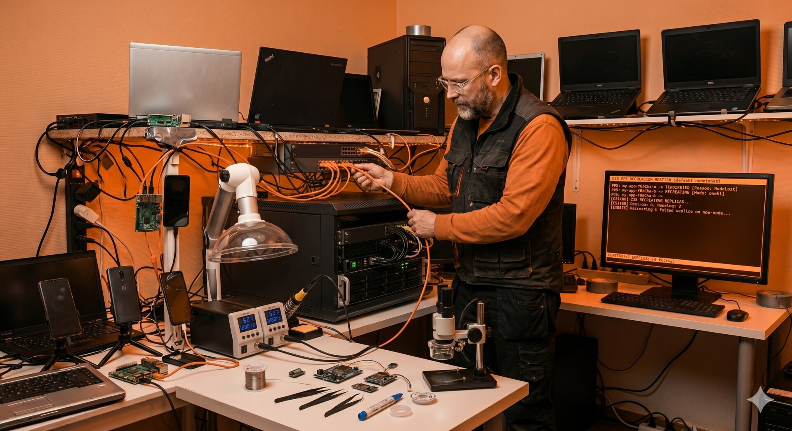

# Frigate NVR Migration on k3s: What Breaks on Bare-Metal

*An old i5 desktop, a stack of stateful workloads, and the reminder that Kubernetes does not abstract away the hardware — it just makes you very specific about what you are ignoring.*

---



*The i5-6600 in the service room, GTX 1050Ti pulled from a retired gaming box, sitting on the shelf next to the inverter that dumps noise on everything within two meters.*

---

## Why Move It at All

Frigate has been running on a Lenovo laptop acting as control plane for the cluster — same node that handles ingress, scheduling, and a 1.8TB drive of video. It worked, more or less. But the laptop was never meant for sustained transcoding, and every busy afternoon in the yard the API server would start to lag.

So when an old i5-6600 desktop landed in my lap with a GTX 1050Ti still in it, the decision was simple: move Frigate to dedicated hardware, free the laptop to be a proper control plane, and use this as an excuse to clean up some shortcuts I was carrying for months.

What I thought would be one weekend of work became a small lesson in why bare-metal teaches you things that managed Kubernetes hides. This post is about those lessons — not about the YAML. The manifests, node configuration, and the small pile of scripts behind all of this live in a companion repo: [github.com/ivemcfire/frigate-migration-k3s](https://github.com/ivemcfire/frigate-migration-k3s).

---

## Architecture: Before and After

**Before**

- Frigate co-located with control plane on a single Lenovo laptop
- One SSD holding OS, kubelet ephemeral storage, SQLite, and 1.8TB of video clips
- Inference on CPU — no GPU advertised to the cluster
- No CPU reservation for system components
- Cameras on the same flat LAN as the rest of the household

**After**

- Frigate isolated on a dedicated i5-6600 + GTX 1050Ti node
- Storage tiered: SSD for OS / kubelet / SQLite, HDD bound to a recordings PV
- GPU exposed as `nvidia.com/gpu` via the device plugin chain
- `--kube-reserved` set so Frigate cannot starve the kubelet
- Cameras on a restricted VLAN with no gateway, firewall rules persisted across reboots

The resulting separation of compute, storage, and networking concerns:

```
                  +----------------------------+
                  |        k3master            |
                  |  (Lenovo laptop, headless) |
                  |  control plane / ingress   |
                  +-------------+--------------+
                                |
                  --------------+--------------  k3s control LAN
                                |
        +-----------------------+-----------------------+
        |                       |                       |
+-------+----------+   +--------+--------+   +----------+---------+
|   frigate01      |   |     phones      |   |   camera VLAN      |
| i5-6600 / 1050Ti |   |  3x OnePlus     |   |  no gateway / L2   |
| SSD: OS, SQLite  |   |  app workloads  |   |  isolated at sw    |
| HDD: recordings  |   |  postmarketOS   |   |                    |
| nvidia.com/gpu   |   |                 |   |                    |
+------------------+   +-----------------+   +--------------------+
```

---

## The Cloud Mindset Does Not Translate

In a managed cluster, migrating a workload is a redeploy. You change the node selector, the pod comes up, the storage follows because somebody else worried about the storage. The control plane is not your problem. The GPU is a resource type you request. The network is flat and works.

On bare metal, every assumption becomes a separate task:

- **Storage** is your problem
- **GPU enablement** is your problem
- **Control plane stability under load** is your problem
- **Network isolation** is your problem

And doing them by hand is what teaches you what those abstractions actually buy you.

A workload like Frigate is a good test case because it depends on three things that Kubernetes does not solve for you out of the box: GPU access for hardware-accelerated inference, sustained disk throughput for continuous recording, and predictable CPU so a busy detection moment does not eat the rest of the cluster. Each of these became its own small story.

---

## GPU Access: The Abstraction Has Edges

**Problem.** Kubernetes does not see your GPU until you teach it to. The first time you hit it, the failure mode is not a clean error — it is a pod that runs, looks healthy, and quietly does CPU inference because nothing in the stack told the workload there was a card available.

**Constraint.** k3s ships its own embedded containerd and regenerates the containerd config on every restart. Any direct edit to the live config gets overwritten on the next reboot. The supported path is to edit the template, not the file.

**Decision.** Wire the full chain end-to-end and treat the template as the source of truth:

1. NVIDIA driver on the host
2. nvidia container runtime
3. containerd template patched for the runtime class
4. device plugin DaemonSet
5. workload requests `nvidia.com/gpu: 1`

**Trade-off.** One more file under config management, and the node is now opinionated about its driver version. In exchange, the GPU is a first-class schedulable resource and survives reboots.

The lesson is bigger than GPUs. On managed Kubernetes, you trust that the platform owns the node configuration. On bare-metal, you have to know which files the platform owns, which it regenerates, and which it leaves alone. This kind of distinction is the whole job description for a platform engineer.

After the chain is wired up, `kubectl describe node` is what proves it:

```
$ kubectl describe node k3frigate

Labels:             nvidia.com/gpu.present=true
                    ...
Capacity:
  cpu:                4
  memory:             16333344Ki
  nvidia.com/gpu:     1
  pods:               110
Allocatable:
  cpu:                4
  memory:             16333344Ki
  nvidia.com/gpu:     1
  pods:               110
...
Allocated resources:
  Resource           Requests       Limits
  --------           --------       ------
  cpu                1560m (39%)    200m (5%)
  memory             10918Mi (68%)  13030Mi (81%)
  nvidia.com/gpu     1              1
```

*The line `nvidia.com/gpu: 1` in both Capacity and Allocatable is what proves the chain is alive.*

---

## Disk Pressure Is the Silent Killer

**Problem.** Frigate writes constantly. Even with event-only recording, nine cameras produce a steady stream of clips, snapshots, and SQLite updates.

If all of that lands on the same SSD that holds the OS and the kubelet's working directories, the kubelet eventually sees the disk filling up and starts evicting pods to recover space. On a single-node-feeling cluster like a homelab, an eviction storm takes out things you actually care about — monitoring, DNS, sometimes ingress. The cluster eats itself trying to save itself.

**Constraint.** I have one fast SSD and one large HDD on this node. SQLite is latency-sensitive — moving the database to spinning rust gets you locking errors under load. Recordings are throughput-bound, not latency-bound, and they need volume.

**Decision.** Tier the storage explicitly:

- **SSD** — OS, kubelet, config, SQLite
- **HDD** — recordings, mounted as a PV bound specifically to that disk via `local-path` with a node affinity

**Trade-off.** An extra StorageClass to maintain, and recordings are now pinned to one node — losing this disk loses history. In exchange, the kubelet gets predictable headroom on the SSD and the eviction manager stays asleep.

I have the journal entry for the day this happened to me, before the tiers were separated. The eviction manager started ranking pods, and Frigate — the largest writer — was first to go:

```
Apr 28 11:00:04 k3master k3s: eviction_manager.go:376
  "Eviction manager: attempting to reclaim" resourceName="ephemeral-storage"

Apr 28 11:00:05 k3master k3s: eviction_manager.go:387
  "Eviction manager: must evict pod(s) to reclaim" resourceName="ephemeral-storage"

Apr 28 11:00:05 k3master k3s: eviction_manager.go:405
  "pods ranked for eviction" pods=[
    "frigate/frigate-745c868597-qd6h2",
    "monitoring/prometheus-...",
    "default/loki-0",
    "kube-system/coredns-...",
    "kube-system/traefik-...",
    "kube-system/local-path-provisioner-...",
    ...
  ]

Apr 28 11:00:07 k3master k3s: eviction_manager.go:629
  "pod is evicted successfully" pod="frigate/frigate-745c868597-qd6h2"
```

*The eviction manager does not care that traefik and coredns are critical — once it starts reclaiming, everything is on the list.*

The principle is not new and it is not Kubernetes-specific. Stateful workloads need a storage plan. The reason this is worth writing down is that the cloud abstracts it completely — you ask for a volume, you get a volume, somebody else reasons about wear and IOPS. On bare-metal, if you don't think about it on day one, you will think about it on day thirty when the cluster falls over and you don't immediately see why.

---

## The Control Plane Is Not An Unlimited Resource Pool

**Problem.** Frigate can saturate four cores easily — multiple cameras detecting motion, the AI pipeline picking up a person, the recording layer flushing to disk.

If the API server is starving for CPU at that moment, scheduling slows down, leader elections misbehave, and the whole cluster feels sick for reasons that look unrelated to the camera stack. You debug the wrong thing for hours.

**Constraint.** Density is a feature on a small cluster — splitting control plane and workloads across separate nodes is not free, and I do not have spare hardware sitting idle.

**Decision.** Reserve resources explicitly for system components via `--kube-reserved`, and apply a CPU limit to Frigate so it degrades gracefully instead of monopolising the node.

**Trade-off.** "Graceful degradation" for a video pipeline means dropped frames. That is the right failure mode here — the alternative is the API server timing out, which costs more than a missed second of footage.

This is the kind of decision that would be invisible in a managed environment, where node sizing is a slider and control plane is somebody else's problem. Here it is a design choice that I had to make consciously.

---

## Networking: Working With What You Have

**Problem.** The new node sits on a different physical switch from the rest of the cluster, in a different part of the apartment, near a solar inverter that dumps electrical noise on everything. The cameras need isolation from the household LAN.

**Constraint.** The household uses a vendor mesh router for Wi-Fi roaming. Replacing it with OpenWrt would break roaming for everybody and OpenWrt does not play nicely with vendor mesh protocols. The router's stock firmware also does not persist iptables rules across reboots.

**Decision.** Hybrid setup:

- Cameras on a restricted VLAN with no gateway
- Switch-level tagging keeps them off the rest of the LAN
- Startup script on the router reapplies firewall rules every boot

**Trade-off.** It is not elegant, and the router is now carrying a bit of script that nobody else in the household knows about. In exchange, isolation holds, the mesh keeps working, and a power cut does not silently re-expose the cameras.

For me, this is the part of the job that recruiters underestimate the most: most production environments are not greenfield, and the value of an engineer is often in shipping a clean solution inside a dirty constraint set, not in demanding the constraints go away.

---

## Design Decisions

The non-obvious calls, kept short:

- **Local-path PV over network storage** — kept video write latency low, accepted that recordings are pinned to one node
- **SQLite on SSD, recordings on HDD** — avoided lock contention under load at the cost of one extra StorageClass
- **CPU limit on Frigate, not bigger node** — homelab constraint; dropped frames is the cheaper failure mode
- **Edit the k3s containerd template, not the live config** — survives k3s restarts, costs one more file under config management
- **Vendor mesh kept, VLAN at the switch** — household roaming requirement; router carries a startup script as the price
- **`--kube-reserved` on the workload node** — protects the API server before it ever notices it is starving

---

## Things That Went Wrong

**The pod was healthy and the GPU was idle.** Inference was running on CPU because the device plugin was deployed, but containerd had not been pointed at the new runtime class. No error, no warning — just a silent fallback. Took me longer than I want to admit.

**SQLite on the HDD is a trap.** I put the entire `/media/frigate` mount on the slow disk on the first pass, including the database. The web UI got slow, then locked, then started returning errors that looked like a Frigate bug. It was a storage decision.

**The control plane started missing heartbeats during stress tests.** No CPU reservation meant Frigate happily took every core, and the API server sometimes did not get its slice in time. Adding `--kube-reserved` solved it in one config change, but the symptom was hours of confused log reading first.

**The router forgot its rules after a power cut.** The VLAN configuration was correct in the GUI, but the iptables rules were not persisted to flash. After the next reboot, the cameras could see the gateway again. Now there is a startup script.

---

## Impact

Approximate, measured over the 30 days after the migration settled:

- **Control plane CPU under load:** ~90–100% → ~40–60%
- **DiskPressure events:** multiple per week → zero in 30+ days
- **Inference path:** CPU (~250–400 ms per frame) → GPU on the 1050Ti (~30–60 ms)
- **API server timeouts during peak camera activity:** routine → none observed
- **Frigate pod restarts:** several per week from evictions and OOM → zero
- **Recording retention:** capped at ~10 days on the shared SSD → 30+ days on the dedicated HDD with headroom

Numbers are from the homelab, not a benchmark rig. They are directionally honest and that is the point — the migration moved the needle on every axis it was meant to.

---

## The Payoff

The migration moved more than just a workload. It moved a class of problems off the control plane and gave the cluster headroom it did not have before. The laptop that used to do everything now does scheduling and ingress, which is what control planes are for. The new node does video, which is what it is good at. Each machine is doing the work it is shaped for, and the boundary between them is documented.

Cloud platforms are built specifically to hide the things this migration forced me to think about — driver chains, storage tiers, control plane isolation, network reality. Hiding them is the right call for most teams, most of the time. But the engineer who has had to do them by hand at least once reads cloud documentation differently. You stop trusting that things "just work" and you start asking *which abstraction is doing the work, and what is its failure mode.*

That is the skill.

Frigate was just the workload. The real work was understanding where the abstractions stop — and what happens when they do.

That boundary is where platform engineering actually begins.

---

## Cluster Context

This runs on the same k3s cluster described in previous posts — three nodes, mixed roles, all bare-metal.

| Node      | Role                              | Hardware                              |
|-----------|-----------------------------------|---------------------------------------|
| k3master  | Control plane, ingress            | x86_64 laptop, headless                |
| frigate01 | Frigate, GPU inference, recording | i5-6600, 12GB RAM, GTX 1050Ti, 4TB HDD |
| phones    | Application workloads             | Three OnePlus devices on postmarketOS  |

Frigate now runs on dedicated hardware. The phone cluster handles application backends. The control plane no longer fights for CPU with a video pipeline. Each node has a clear job, and the cluster as a whole is calmer for it.

---

Repo: [github.com/ivemcfire/frigate-migration-k3s](https://github.com/ivemcfire/frigate-migration-k3s) — manifests, node config, storage tier, router script.

*Previous posts: [Running Edge AI on Broken Phones](edge-ai-phones.html) · [The Kubernetes Sidecar Pattern](sidecar-pattern.html) · [Running Frigate NVR on Kubernetes](frigate-nvr.html) · More at [ivemcfire.github.io](https://ivemcfire.github.io)*
